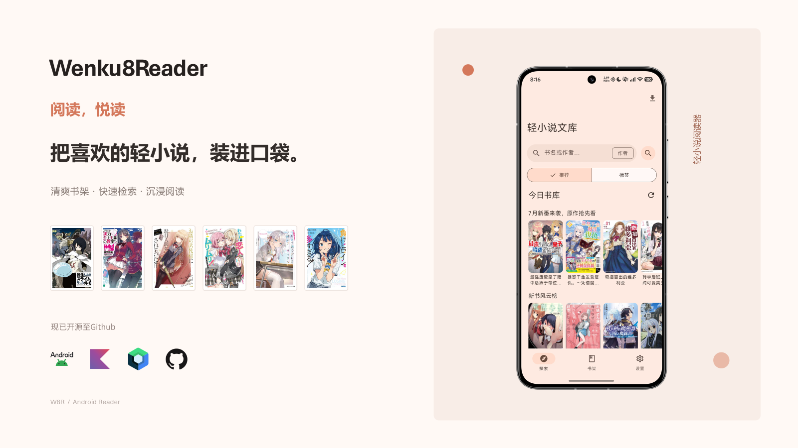

#  轻小说文库（Wenku8Reader）

> 一款面向轻小说爱好者的 Android 阅读客户端，数据来自 wenku8.net 轻小说文库。

## 简介

**轻小说文库**是一款原生 Android 阅读器：浏览 wenku8 全站栏目、搜索与分类找书、一键加入书架，并内置了沉浸式在线阅读器——支持侧滑翻页、自动翻页、音量键翻页、简繁转换，还可将整本书离线下载为 TXT / EPUB 随时阅读。

应用采用 **Material Design 3** 设计语言：卡片化界面、动态取色（跟随系统壁纸生成主题色）、深色/纯黑（OLED 省电）模式，并适配 120Hz 高刷新率屏幕，滑动与翻页顺滑跟手。

## 功能特性

-  **探索发现**：首页栏目（封面轮播 + 文字榜单）、书名/作者搜索、分类标签浏览
-  **我的书架**：收藏管理、多种排序（默认/最近更新/书名/字数/倒序）、一键继续阅读
-  **沉浸式阅读器**：
  - 侧滑翻页 / 滚动翻页双模式，点按左右翻页
  - 自动翻页（可设间隔）、音量键翻页
  - 章节进度自动记录，重开自动续读
  - 简体 ↔ 繁体一键切换
  - 阅读外观自由定制：背景色/背景图、正文字色、字体、字号、行距、四周边距
  - 插图章节直接显示图片
-  **离线下载**：整本下载为 TXT（简/繁/UTF-8）或 EPUB，保存至 `Downloads/Wenku8/`
-  **个性化外观**：动态取色 / 手动种子色、深色模式（跟随系统/浅色/深色）、OLED 纯黑模式

## 界面一览

| 页面 | 说明 |
|---|---|
| 探索 | 折叠大顶栏 + 圆角搜索条，推荐/标签双 Tab，封面卡片流 |
| 书架 | 卡片化书单，进度一目了然，一键续读 |
| 详情 | 封面信息卡、标签药丸、开始/继续阅读、离线下载卡、内容简介 |
| 阅读器 | 沉浸式全屏，状态指示器（电量/时间/章节/进度），悬浮章节进度条 |
| 设置 | 分组卡片：账号、外观（主题/纯黑/取色）、阅读设置、关于 |

## 系统要求

- Android 8.0（API 26）及以上
- 建议 Android 12+ 以体验完整的动态取色与高刷新率效果

## 下载与构建

- **安装包**：构建产物位于 `app/build/outputs/apk/debug/app-debug.apk`（Debug 包）
- **自行构建**：使用 Android Studio 打开项目目录，等待 Gradle 同步完成后点击 **Run ▶**；或命令行执行 `gradle :app:assembleDebug`
- 需要 JDK 17+ 与 Android SDK 34

## 技术栈

原生 **Kotlin + Jetpack Compose + Material Design 3** 构建，无 WebView 外壳；网络层基于 OkHttp + Cronet，图片加载使用 Coil，简繁转换使用 opencc4j。

## 声明

- 本应用仅用于**个人学习与交流**，请遵守 wenku8.net 站点使用条款，支持正版。
